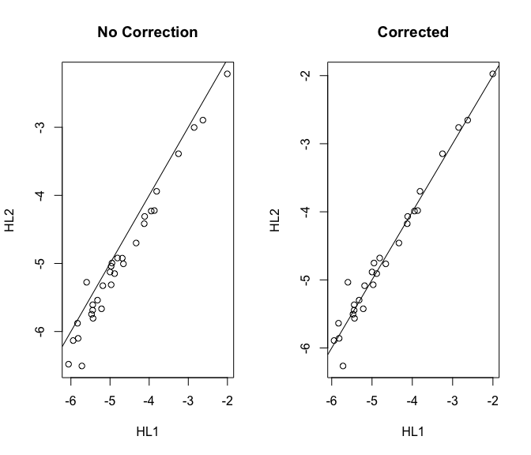
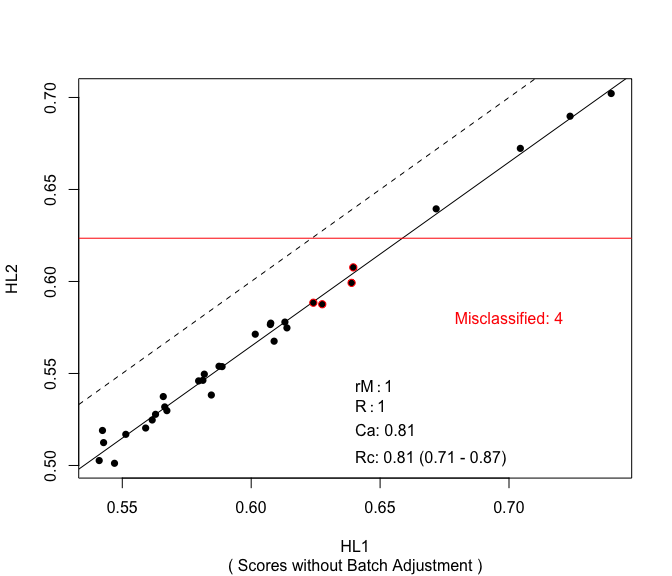

The `nanostringr` R package is a companion R package to the manuscript:

A. Talhouk, S. Kommoss, R. Mackenzie, M. Cheung, S. Leung, D. Chiu, S.
Kalloger, D. Huntsman, S. Chen, M. Intermaggio, J. Gronwald, F. Chan, S.
Ramus, C. Steidl, D. Scott, M. Anglesio. (2016). Single-patient
molecular testing with NanoString nCounter Data using a reference-based
strategy for batch effect correction. *PLos ONE*.

This vignette provides a guide to reproduce the analyses in the paper
and document the use of some of the functions.

The Data
========

Included in this package are several datasets that are described in
detail in the manuscript and that are annotated in expQC, the annotation
data frame for all of the experiments, run in different CodeSets,
including:

-   **Hodgkin Lymphoma Clinical Samples (HL)** TOTAL 74 samples
    -   HL1 n=32 Unique Samples
    -   HL2 n=32 Replicates of HL1 samples
    -   HL3 n=10 Replicates (subset of HL1 samples)
-   **Ovarian Cancer Clinical Samples (OC)** TOTAL 258 samples
    -   OC1 n=129 Unique
    -   OC2 n=129 Replicates of OC1 samples
-   **Ovarian Cancer Cell Lines (OVCL)** TOTAL 26
    -   OC1 n=13 Unique
    -   OC2 n=13 Replicates of OC1 samples
-   **DNA Oligonucleotides for the HL CodeSet (HLO)** TOTAL 68 HLO pool
    run at different concentrations
    -   HL1 n=36  
    -   HL2 n=30  
    -   HL3 n=2
-   **DNA Oligonucleotides for the OC CodeSet (OVO)** TOTAL 135 OVO pool
    run at different concentrations
    -   OC1 n=47  
    -   OC2 n=88

The Functions
=============

NanoStringQC
------------

The NanoStringQC function computes several QC metrics and appends them
to the annotation matrix. Care should be taken to ensure that the data
is in the proper format. The function returns different QC metric flags
that can be used to filter out samples that fail QC.

    library(nanostringr)
    expOVD <- NanoStringQC(ovd.r, subset(expQC, OVD == "Yes"))
    expOVO <- NanoStringQC(ovo.r, subset(expQC, OVO == "Yes"))
    expOVCL <- NanoStringQC(ovc.r, subset(expQC, OVCL == "Yes"))
    expHLD <- NanoStringQC(hld.r, subset(expQC, HLD == "Yes"))
    expHLO <- NanoStringQC(hlo.r, subset(expQC, HLO == "Yes"))
    expQC <- rbind(expHLD, expOVD, expHLO, expOVO, expOVCL)
    expQC$cohort <- factor(c(rep("HLD", nrow(expHLD)), 
                    rep("OVD", nrow(expOVD)), rep("HLO", nrow(expHLO)),
                    rep("OVO", nrow(expOVO)), rep("OVCL", nrow(expOVCL))))
    expQC <- expQC %>% 
      mutate(cohort = factor(stringr::str_replace_all(cohort,
                                                      c("HLD" = "HL",
                                                        "OVD" = "OC")),
                             levels = c("HL", "OC", "OVCL", "HLO", "OVO")))

### Metrics for Quality Assurance

### Fields Of View (FOV)

    boxplot(perFOV ~ cohort, ylab = "% FOV", main = "% FOV by Cohort", data = expQC, pch = 20,
            col = c(COL.HLD, COL.OVD, COL.OVCL, COL.HLO, COL.OVO))
    abline(h = 75, lty = 2, col = "red")
    grid(NULL, NULL, lwd = 1)

### Postive Controls

#### Linearity of Positive Controls

    boxplot(linPC ~ cohort, ylab = expression(R ^ 2), main = "Linearity of Positive Controls by Cohort",
            data = expQC, pch = 20, col = c(COL.HLD, COL.OVD, COL.OVCL, COL.HLO, COL.OVO), ylim = c(0, 1))
    abline(h = 0.95, lty = 2, col = "red")
    grid(NULL, NULL, lwd = 1)

### Signal to Noise Ratio (SNR)

#### Level of Housekeeping Genes

    boxplot(averageHK ~ cohort, ylab = "Average log HK expression",
            main = "Average log expression of Housekeeping genes by Cohort", data = expQC, pch = 20,
            col = c(COL.HLD, COL.OVD, COL.OVCL, COL.HLO, COL.OVO))
    abline(h = 50, lty = 2, col = "red")
    grid(NULL, NULL, lwd = 1)

#### Limit of Detection (LOD)

    boxplot(lod ~ cohort, ylab = "LOD", main = "Limit of detection (LOD) by Cohort",
            data = expQC, pch = 20, col = c(COL.HLD, COL.OVD, COL.OVCL, COL.HLO, COL.OVO))
    abline(h = 50, lty = 2, col = "red")
    grid(NULL, NULL, lwd = 1)

    boxplot(pergd ~ cohort, data = expQC, border = "white",
           ylab = "% Genes Detected", 
           main = "Percent of Genes Detected Above \n the Limit of Detection", 
           pch = 20, col = c(COL.HLD, COL.OVD, COL.OVCL, COL.HLO, COL.OVO))
    abline(h = 50, lty = 2, col = "red")
    grid(NULL, NULL, lwd = 1)
    stripchart(pergd ~ cohort, data = expQC, 
               vertical = TRUE, method = "jitter",  
               pch = 20, cex = 0.4 , col = "#3A6EE3", 
               add = TRUE) 

    sn <- 100
    detect <- 60

    plot(expOVD$sn, expOVD$pergd, pch = 20, col = COL.OVD, xaxt = "n", ylim = c(0, 100), xlim = range(expOVD$sn),
         xlab = "Signal to Noise Ratio", ylab = "% Genes Detected")
    points(expOVO$sn, expOVO$pergd, pch = 20, col = COL.OVO)
    points(expOVCL$sn, expOVCL$pergd, pch = 20, col = COL.OVCL)
    points(expHLD$sn, expHLD$pergd, pch = 20, col = COL.HLD)
    points(expHLO$sn, expHLO$pergd, pch = 20, col = COL.HLO)
    axis(1, at = seq(0, max(expQC$sn) + 1, 300))
    abline(v = sn, col = "red", lwd = 2)
    abline(h = detect, lty = 2)
    title("Signal to Noise vs \n Ratio of Genes Detected")
    legend("bottomright", c("HL", "OC", "OVCL", "HLO", "OVO"), pch = 20, bty = 'n',
           col = c(COL.HLD, COL.OVD, COL.OVCL, COL.HLO, COL.OVO))

    plot(expOVD$sn, expOVD$pergd, pch = 20, col = COL.OVD, xaxt = "n", ylim = c(0, 100), xlim = c(0, 6000),
         xlab = "Signal to Noise Ratio ", ylab = "Ratio of Genes Detected")
    points(expOVO$sn, expOVO$pergd, pch = 20, col = COL.OVO)
    points(expOVCL$sn, expOVCL$pergd, pch = 20, col = COL.OVCL)
    points(expHLD$sn, expHLD$pergd, pch = 20, col = COL.HLD)
    points(expHLO$sn, expHLO$pergd, pch = 20, col = COL.HLO)
    axis(1, at = seq(0, max(expQC$sn) + 1, 300))

    abline(v = sn, col = "red", lwd = 2)
    abline(h = detect, lty = 2)
    title("Signal to Noise vs \n Ratio of Genes Detected (Zooming-in)")
    legend("bottomright", c("HL", "OC", "OVCL", "HLO", "OVO"), pch = 20, bty = 'n',
           col = c(COL.HLD, COL.OVD, COL.OVCL, COL.HLO, COL.OVO))

HKnorm
------

The HKnorm function does a simple normalization to log transformed (base
2) gene expression data data to housekeeping genes. This is done by
subtracting the average log housekeeping gene expression level from the
expression level of every gene in each sample.

As an example, here we check the QC metrics of the Hodgkin Lymphoma data
and normalize it to housekeeping genes:

We can check to see if any samples failed QC metrics

    expHLD0 <- expHLD
    any(expHLD0$QCFlag == "Failed")

\[1\] TRUE

    expHLD0$sampleID[which(expHLD0$QCFlag == "Failed")]

\[1\] "HL1\_18"

Since these are matched samples we must remove both pairs from the
annotation data frame and from the gene expression data frame.

    expHLD <- filter(expHLD0, sampleID != "HL1_18" & sampleID != "HL2_18")
    hld <- hld.r[, !colnames(hld.r) %in% c("HL1_18", "HL2_18")]

We now normalize the resulting gene expression data

    # If data already log normalized
    hld.n <- HKnorm(hld, is.logged = TRUE)

    # Otherwise, normalize to HK 
    hld.n <- HKnorm(hld)
    hld1 <- hld.n[, grep("HL1", colnames(hld.n))]
    exp.hld1 <- subset(expHLD, geneRLF == "HL1")

    hld2 <- hld.n[, grep("HL2", colnames(hld.n))]
    exp.hld2 <- subset(expHLD, geneRLF == "HL2")

refMethod
---------

This function does batch adjustment using a reference-based strategy.

Below is how this would work for the HL data:

    r <- 3 # The number of references to use
    choice.refs <- exp.hld1$sampleID[sample((1:dim(exp.hld1)[1]), r, replace = F)] # select reference samples randomly
    R1 <- t(hld1[, choice.refs])
    R2 <- t(hld2[, paste("HL2", getNum(choice.refs), sep = "_")])
    Y <- t(hld2[, !colnames(hld2) %in% paste("HL2", getNum(choice.refs), sep = "_")])
    S2.r <- t(refMethod(Y, R1, R2)) # Data from CodeSet 2 now calibrated for CodeSet 1

We can check the result by selecting a random gene and plotting the
expression values from both CodeSets

    set.seed(2016)
    gene <- sample(1:nrow(hld1), 1)
    par(mfrow = c(1, 2))
    plot(t(hld1[gene, ]), t(hld2[gene, ]), xlab = "HL1", ylab = "HL2",
         main = "No Correction")
    abline(0, 1)

    plot(t(hld1[gene, !(colnames(hld1) %in% choice.refs)]), t(S2.r[gene, ]),
         xlab = "HL1", ylab = "HL2", main = "Corrected")
    abline(0, 1)

Downstream Analysis
===================

In the previous analysis we compared the gene expression value of an
individual gene. Below is the impact on a downstream analysis. We use
the HL prognostic model as an example. For additional information on
this model, the reader is referred to the
[paper](http://journals.plos.org/plosone/article?id=10.1371/journal.pone.0153844).

    library(CHL26predictor)

    # We select the genes that are used in the model
    CHL26.HL1.exprs <- hld.n[rownames(hld.n) %in% CHL26.model.coef.df$geneName,
                             grep("HL1", colnames(hld.n))] + log(1000, 2)
    CHL26.HL2.exprs <- hld.n[rownames(hld.n) %in% CHL26.model.coef.df$geneName,
                             grep("HL2", colnames(hld.n))] + log(1000, 2)

    # This is the threshold
    risk.thres <- 0.6235
    n <- dim(CHL26.HL1.exprs)[2]

    # We compute the risk scores in each CodeSet
    scores.df1 <- get_CHL26_scores(as.matrix(CHL26.HL1.exprs))
    scores.df2 <- get_CHL26_scores(as.matrix(CHL26.HL2.exprs))

    scores.risk.df1 <- scores.df1 %>%
      mutate(riskClass = ifelse(score >= risk.thres, "High", "Low"))

    scores.risk.df2 <- scores.df2 %>%
      mutate(riskClass = ifelse(score >= risk.thres, "High", "Low"))

    # We assess how many cases are misclassified
    tabRisk <- table(scores.risk.df1$riskClass, scores.risk.df2$riskClass)
    ind.mis <- which(scores.risk.df1$riskClass != scores.risk.df2$riskClass)

    mis <- n - sum(diag(tabRisk))

<table>
<thead>
<tr class="header">
<th align="left">Accuracy</th>
<th align="right">Freq</th>
</tr>
</thead>
<tbody>
<tr class="odd">
<td align="left">0.98</td>
<td align="right">1</td>
</tr>
<tr class="even">
<td align="left">0.99</td>
<td align="right">156</td>
</tr>
<tr class="odd">
<td align="left">1</td>
<td align="right">1343</td>
</tr>
</tbody>
</table>

Another visualization to assess concordance correlation is the
Bland-Altman plot or the MA plot:

<table>
<thead>
<tr class="header">
<th align="left"></th>
<th align="right">Metrics</th>
</tr>
</thead>
<tbody>
<tr class="odd">
<td align="left">Rc</td>
<td align="right">0.81</td>
</tr>
<tr class="even">
<td align="left">Ca</td>
<td align="right">0.81</td>
</tr>
<tr class="odd">
<td align="left">R2</td>
<td align="right">1.00</td>
</tr>
</tbody>
</table>
