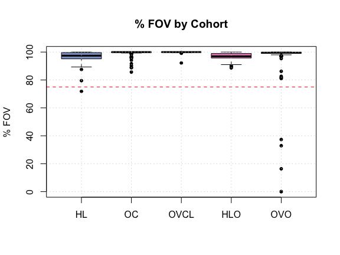
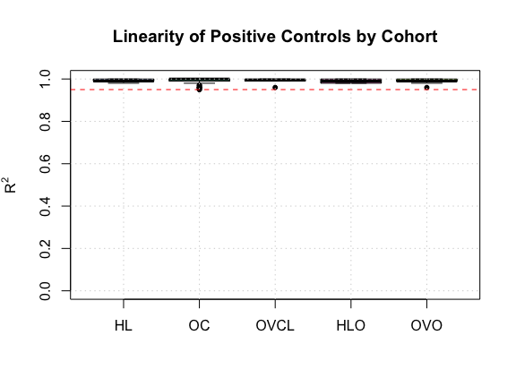
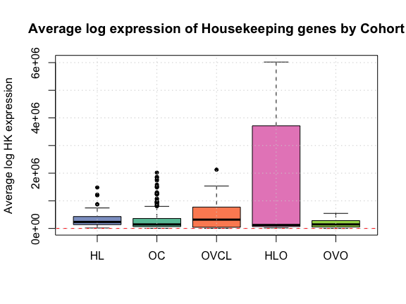
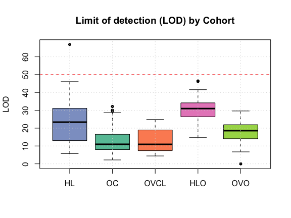
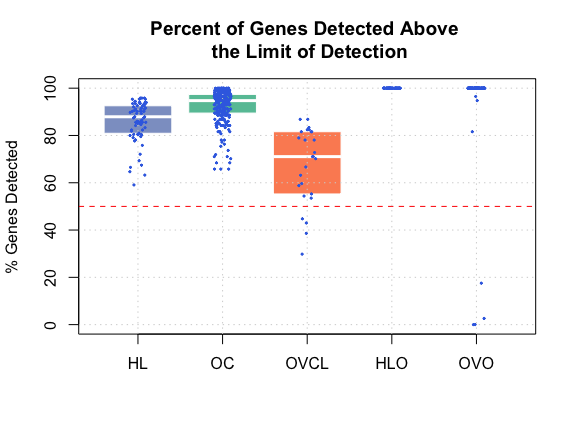
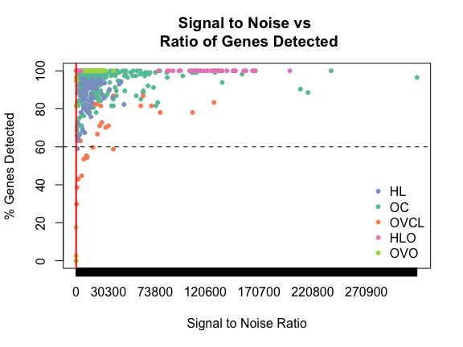
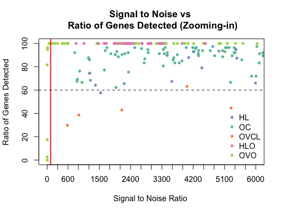
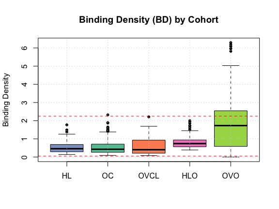
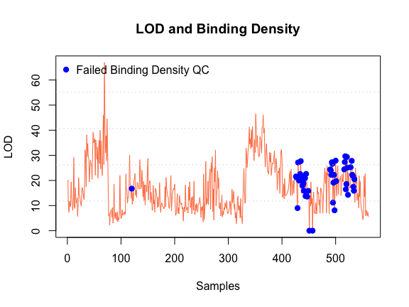
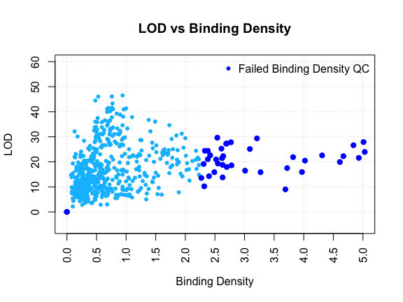

# Introduction to using the nanostringr package
Aline Talhouk  


```r
library(nanostringr)
expOVD <- NanoStringQC(ovd.r,subset(expQC,OVD=="Yes"), plot="F")
expOVO <- NanoStringQC(ovo.r,subset(expQC,OVO=="Yes"),plot="F")
expOVCL <- NanoStringQC(ovc.r,subset(expQC,OVCL=="Yes"),plot="F")
expHLD <- NanoStringQC(hld.r,subset(expQC,HLD=="Yes"),plot="F")
expHLO <- NanoStringQC(hlo.r,subset(expQC,HLO=="Yes"),plot="F")
expQC <- rbind(expHLD,expOVD,expHLO,expOVO,expOVCL)
expQC$cohort <- factor(c(rep("HLD", nrow(expHLD)), 
                rep("OVD", nrow(expOVD)),rep("HLO",nrow(expHLO)),
                rep("OVO", nrow(expOVO)), rep("OVCL", nrow(expOVCL))))
expQC <- expQC %>% 
  mutate(cohort = factor(stringr::str_replace_all(cohort,
                                                   c("HLD" = "HL",
                                                     "OVD" = "OC")),
                          levels = c("HL", "OC", "OVCL", "HLO", "OVO")))
```


# Metrics for Quality Assurance


## Fields Of View (FOV) 
 

<div class="figure">

<p class="caption">Samples that failed imaging QC based on percent fields of view (FOV) counted across cohorts</p>
</div>


## Postive Controls
    
### Linearity of Positive Controls

<div class="figure">

<p class="caption">Plot of $R^2$ of postive control probles from samples across all cohorts.</p>
</div>


## Signal to Noise Ratio (SNR)

### Level of Housekeeping Genes

<div class="figure">

<p class="caption">Average log expression of Housekeeping genes by Cohort.</p>
</div>


### Limit of Detection (LOD)

<div class="figure">

<p class="caption">Limit of detection by cohort.</p>
</div>


<div class="figure">

<p class="caption">Percent genes of total (excluding controls) detected above the limit of detection</p>
</div>


<div class="figure">

<p class="caption">Signal to Noise versus % Gene Detected by cohort</p>
</div>

<div class="figure">

<p class="caption">Signal to Noise versus % Gene Detected by cohort zoomed in to the area of possible failures</p>
</div>


## Binding Density (BD)

<div class="figure">

<p class="caption">Binding density by cohort. Samples outside of the dashed lines are flagged for having failed the binding density QC measure</p>
</div>



